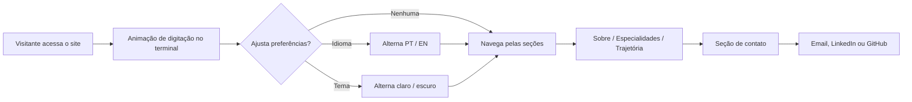

# 💼 Guilherme Lima — Portfólio Profissional

<p align="center">
  
  
  
  
</p>

<p align="center">
  <strong>Site profissional de página única com estética de terminal, tema claro/escuro e suporte bilíngue PT/EN — sem frameworks, sem build step.</strong>
</p>

---

## 📑 Navegue pelo projeto

<p align="center">

| 🎯 [Visão geral](#-visão-geral) | 🚀 [Início rápido](#-início-rápido) | 🏗️ [Estrutura](#-estrutura-do-repositório) | 📋 [Workflow](#-workflow) |
|:---:|:---:|:---:|:---:|

</p>

## 🎯 Visão geral

Página única (`index.html`) que serve como cartão de visitas digital para **Guilherme Lima, Sr. Salesforce Solution Architect**. O visual é inspirado em interfaces de terminal/desenvolvedor — janela de comando, prompt, cursor piscando — e reúne seções de apresentação, especialidades, trajetória profissional e contato, tudo em um único arquivo HTML autocontido.

> *"Arquitetura que sustenta o negócio, não só o sistema."*

### ✨ Por que essa abordagem?

- **Zero dependências de build**: é HTML, CSS e JavaScript puros — abre direto no navegador ou em qualquer hospedagem estática.
- **Bilíngue nativo**: alternância PT/EN instantânea via dicionário de traduções em JavaScript, sem recarregar a página.
- **Tema claro/escuro**: troca de tema com CSS custom properties, sem flash de conteúdo.
- **Fácil de manter**: todo o conteúdo textual está centralizado no objeto `translations`, facilitando atualizações sem mexer na estrutura HTML.
- **Leve e rápido**: sem frameworks, sem dependências externas além de fontes do Google Fonts.

---

## 🚀 Início rápido

### 1. Baixe o projeto

```bash
git clone <url-do-repositorio>
cd portfolio-guilherme-lima
```

### 2. Abra localmente

```bash
# opção simples: abrir direto no navegador
open index.html

# opção com servidor local (recomendado para testar bem)
python3 -m http.server 8000
```

### 3. Publique

```bash
# exemplo com GitHub Pages, Netlify ou Vercel:
# basta apontar a hospedagem estática para a raiz do repositório
# (não há passo de build)
```

---

## 🏗️ Estrutura do repositório

```text
📦 personal-site
 ├── 📁 .github/
 │   ├── 📄 dependabot.yml 
 ├── 📄 index.html        # site completo (estrutura, estilo e script em um único arquivo)
 ├── 📄 README.md
 ├── 📄 script.js
 └── 📄 styles.css
```

---

## 📋 Workflow

> Fluxo de navegação do visitante na página — não há back-end, todo o comportamento é client-side.



### 📌 Convenção de chaves de tradução

| Padrão | Quando usar | Exemplo |
| --- | --- | --- |
| `nav_*` | Itens do menu de navegação | `nav_about`, `nav_contact` |
| `s{n}_*` | Textos dos cards de especialidades | `s1_title`, `s2_desc` |
| `exp{n}_*` | Itens da linha do tempo de trajetória | `exp1_yr`, `exp2_desc` |
| `contact_*` | Textos da seção de contato | `contact_title`, `contact_p` |

### 🏷️ Stack-alvo

| Camada | Tecnologia | Papel |
| --- | --- | --- |
| Estrutura | HTML5 semântico | Marcação das seções e conteúdo |
| Estilo | CSS3 (custom properties) | Temas claro/escuro, layout responsivo |
| Interatividade | JavaScript vanilla | i18n PT/EN, toggle de tema, efeito de digitação |
| Tipografia | Google Fonts — JetBrains Mono & Inter | Identidade visual de terminal + legibilidade |

---

<p align="center">
  <a href="#-guilherme-lima--portfólio-profissional">⬆️ Voltar ao topo</a>
</p>